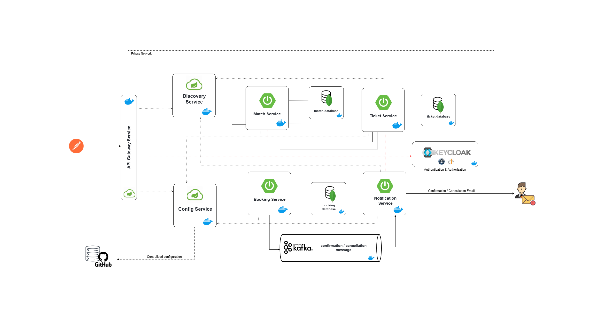

# Stadium Hub - Microservices Football ticketing System

A modern, scalable football ticketing system built using microservices architecture. The system enables users to discover, book, and manage football matches tickets efficiently with real-time notifications.

## System Architecture

The system consists of the following microservices and components:



### Core Services

1. **API Gateway Service**
   - Entry point for all client requests
   - Handles request routing and load balancing
   - Integrates with Keycloak for authentication

2. **Discovery Service**
   - Service registry and discovery
   - Enables dynamic service registration and lookup
   - Facilitates service-to-service communication

3. **Config Service**
   - Centralized configuration management
   - Pulls configuration from GitHub repository
   - Provides dynamic configuration updates

4. **Match Service**
   - Manages stadium matches and events
   - Stores match details in dedicated database
   - Provides match availability information

5. **Ticket Service**
   - Handles ticket reservations and management
   - Maintains ticket inventory
   - Manages ticket status and validation

6. **Booking Service**
   - Processes booking requests
   - Manages booking lifecycle
   - Integrates with payment systems
   - Publishes booking events to Kafka

7. **Notification Service**
   - Sends confirmation/cancellation emails
   - Processes booking events from Kafka
   - Handles all user communications

### Infrastructure Components

- **Keycloak**
  - Authentication and Authorization server
  - User management and identity provider
  - OAuth2 and OpenID Connect support

- **Apache Kafka**
  - Event streaming platform
  - Handles booking events
  - Enables asynchronous communication between services

- **Databases**
  - Dedicated databases for Match, Ticket, and Booking services
  - Ensures data isolation and service autonomy

## Technology Stack

- **Backend**: Spring Boot, Spring Cloud
- **Service Discovery**: Spring Cloud Netflix Eureka
- **API Gateway**: Spring Cloud Gateway
- **Configuration**: Spring Cloud Config
- **Message Broker**: Apache Kafka
- **Authentication**: Keycloak
- **Containerization**: Docker
- **Database**: MongoDB (per service)

## Getting Started

### Prerequisites

- Java 17 or higher (only required for local development without Docker)
- Maven (only required for local development without Docker)
- Docker and Docker Compose
- Git

### Installation

1. Clone the repository:
```bash
git clone https://github.com/yourusername/stadium-hub.git
cd stadium-hub
```

2. Build all microservices (run this command in each microservice directory):
```bash
cd [microservice-directory]  # e.g., match-service, ticket-service, etc.
./mvnw clean package
```

3. Start infrastructure services:
```bash
docker-compose up -d
```

### Service Ports

- API Gateway: 8888
- Discovery Service: 8761
- Config Service: 9999
- Match Service: 8080
- Ticket Service: 8081
- Booking Service: 8082
- Notification Service: 8083
- Keycloak: 8181

## Contributing

1. Fork the repository
2. Create your feature branch (`git checkout -b feature/AmazingFeature`)
3. Commit your changes (`git commit -m 'Add some AmazingFeature'`)
4. Push to the branch (`git push origin feature/AmazingFeature`)
5. Open a Pull Request

## Contact

Email: [Salmane El Mourtaji](mailto:elmourtajisalmane@gmail.com) 
</br>
LinkedIn: [Salmane El Mourtaji](https://www.linkedin.com/in/salmane-el-mourtaji-915185252/)
